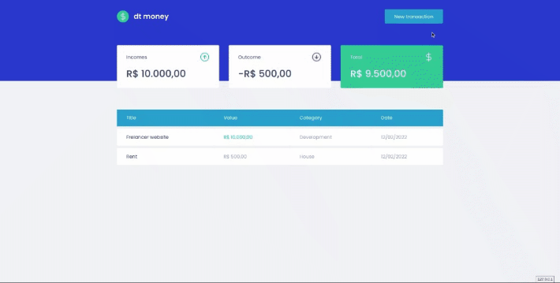

# DT Money

    This is a way to have control over your expenses, you can add new incomes and outcomes, the system is going to calculate the total amount of money you have.
    This application was made in typescript using react as a front-end framework, there's no backend created, so was used mirage js to simulate one.

## Screenshots

### Adding new transaction

 

### Responsivity
